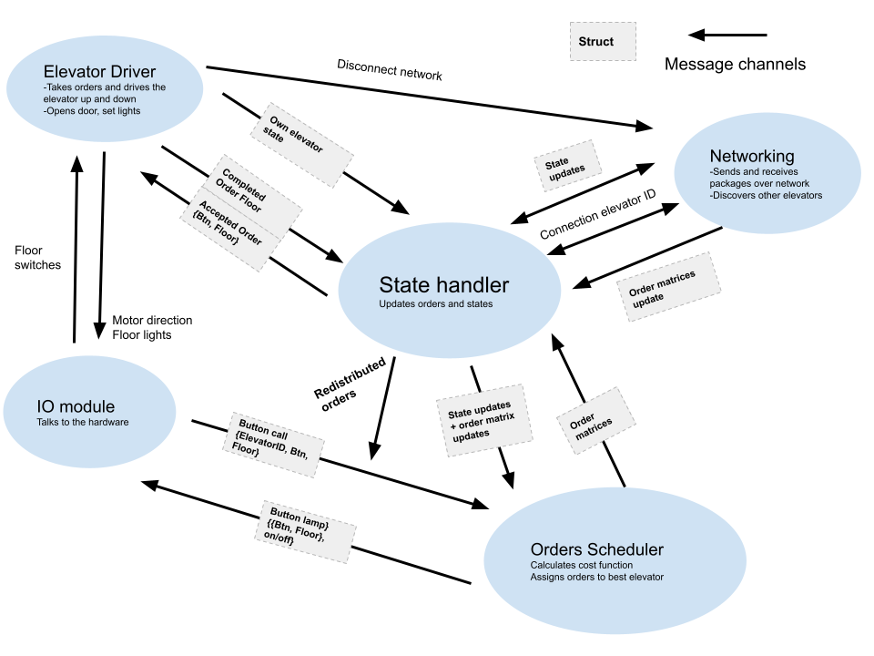

# Elevator Project

## Summary
-------
Controlling `n` elevators working in parallel across `m` floors.

The file *config.go* contains all user modifiable parameters, like network ports and 

## Building and running the project

### To run:

`go run ./main.go -id <elevator ID, 0, 1, 2...> -port <port, 54321>`

- The elevator ID is a unique number starting from 0, and must not exceed the (number of allowed elevators - 1). The default is 0
- The port number must match the port used by the elevator hardware driver server, or the elevator simulator. The default port is defined in the config file, 15657

### To build:

`go build main.go`

This will create an executable called "main".

### Some considerations using golang
The project must be in GOPATH

To fix import issues while using golang version 1.16 or higher:
run `go env -w GO111MODULE=auto`

Windows:
- remember to add to environment GOPATH (Miljøvariabler på norsk)
- Open Control Panel » System » Advanced » Environment Variables
- Click on GOPATH and select edit
- add path to project, like "C:/go/project-gruppe-63"
- apparently only one path should be set in GOPATH, so delete the existing one

## Credits
The golang packages "elevio" and "network" are from https://github.com/TTK4145/driver-go and https://github.com/TTK4145/Network-go. The cost function in "costfunction.go" is heavily inspired by the cost function in https://github.com/TTK4145/Project-resources 

## System overview

The system is organised around separate modules running in threads, with message passing channels between them. 

### Network
The network topology is peer to peer, the nodes are reciprocal and equal. We use UDP sockets and broadcasts messages to all listening receivers. 
The packages are idemponent, which means that it doesn't matter in which orders the packages are received. 
Packet loss is dealt with by sending many copies of the same package each time we send, and equal packages are filtered out on the receiving side.

### Order scheduling
The order scheduler receives button calls and distributes the orders according to the cost function. The cost function simulates which elevator should take the order, and finds the best one.
The order scheduler gets updates from state handler on the state and orders of the different elevators.

### Elevator driver
The elevator driver takes care of the day to day elevator driving. It receives orders from state handler and executes them by driving the elevator up and down. 
It opens and closes the door when appropriate, and disconnects the elevator from the network if it senses that something is wrong (Like motor failure or door stuck).

### State handler
The state handler keeps track of the state and orders of all the elevators. It updates based on inputs from order scheduler or incoming updates from the other elevators. 
It keeps a record of connected elevators and handles disconnecting elevators, redistributing the orders from that elevator to order scheduler. 

The orders are stored in an order matrix. The order matrix is a (buttons x floors) matrix containing the state of the order. The order state can be changed according to a set of rules, in order to prevent overwriting the order state between the different elevators. The order can be None, New, Acknowledged, Accepted, Completed and Unknown. Normally the orders can only be updated from left to right,

`None->New, New->Ack, Ack->Accepted, Accepted->Completed, Completed->None, Unknown->Any, (as well as some exceptions)`

The Ack and Completed steps are there to make sure the other elevators receive the order status before it reverts to Accepted and None. This way the other elevators are "guaranteed" to have a correct backup of the current orders of the elevator, in case it crashes. 

### Iomodule
This module is just a wrapper around the library "elevio" using message passing channels.

